<!-- Thanks to vaaski for the SVG frame and inspiration -->
<h3 align="center">
  <a href="https://github.com/vaaski/vaaski">
    <!-- ts school Chromebook so ass this SVG lags it wtf 😭😭😭 -->
    
  </a>
</h3>

<!-- Goofy view counter using journey-ad's Moe Counter. Might remove because it’s somewhat suggestive, but idk ¯\_(ツ)_/¯ -->
<h3 align="center">
  
</h3>

<!-- Bunch of shields.io and shields.io style badges -->
<h3 align="center">
  <!-- Another view counter; this one is in the shields.io style, made by antonkomarev and breaks occasionally -->
  
  <!-- shields.io badge that shows how many stars I have on all my repos combined; links to shields.io -->
  
  <!-- shields.io badge that shows how many followers I have; links to my followers page -->
  
  <!-- shields.io badge that shows what license I have on this repo; links to the license as raw text -->
  
  <!-- Very cool shields.io style badge using discord-md-badge by gitlimes, shows when I’m active on Discord. LIMES ARE NOT PINK -->
  
</h3>

## 🎶 Spotify Activity

<h3 align="center">
  
  
</h3>

My top albums this month

 
<!-- STATSFM START -->

<a href="https://open.spotify.com/album/1NRRN5RWwfuLmQdjshz0L7" target="_blank" rel="noopener noreferrer">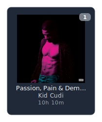</a><a href="https://open.spotify.com/album/4SZko61aMnmgvNhfhgTuD3" target="_blank" rel="noopener noreferrer">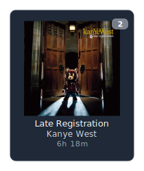</a><a href="https://open.spotify.com/album/051vvnKIC9VaY8vw4R2s0y" target="_blank" rel="noopener noreferrer">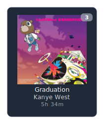</a><a href="https://open.spotify.com/album/4PWBTB6NYSKQwfo79I3prg" target="_blank" rel="noopener noreferrer">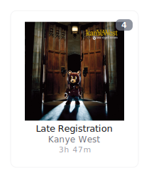</a><a href="#" target="_blank" rel="noopener noreferrer">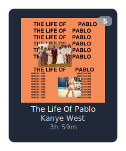</a><a href="https://open.spotify.com/album/1Lt8ADtFWXost5wFYbr6oS" target="_blank" rel="noopener noreferrer">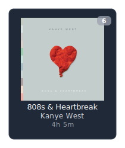</a><a href="https://open.spotify.com/album/2Wiyo7LzdeBCsVZiRA6vVZ" target="_blank" rel="noopener noreferrer">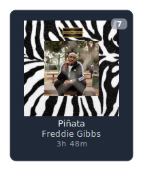</a>

<a href="https://open.spotify.com/album/2S8AWAM0nxyFy66YnUfIs3" target="_blank" rel="noopener noreferrer">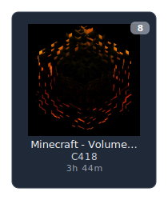</a><a href="https://open.spotify.com/album/6klUp8sQyRXGuJhqZu4PG3" target="_blank" rel="noopener noreferrer">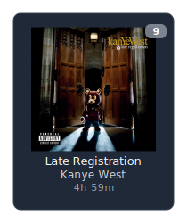</a><a href="https://open.spotify.com/album/19bQiwEKhXUBJWY6oV3KZk" target="_blank" rel="noopener noreferrer">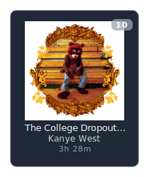</a><a href="https://open.spotify.com/album/0XTAmejG8F97wF5MWoVbaY" target="_blank" rel="noopener noreferrer">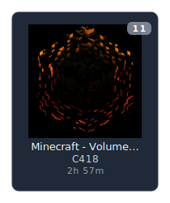</a><a href="https://open.spotify.com/album/7CYDRyFCKtAYJBSpfovLyX" target="_blank" rel="noopener noreferrer">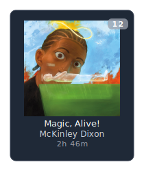</a><a href="https://open.spotify.com/album/40QTqOBBxCEIQlLNdSjFQB" target="_blank" rel="noopener noreferrer">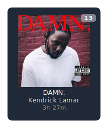</a><a href="#" target="_blank" rel="noopener noreferrer">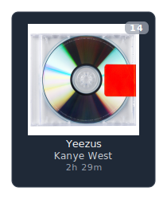</a>

<a href="https://open.spotify.com/album/1GG6U2SSJPHO6XsFiBzxYv" target="_blank" rel="noopener noreferrer">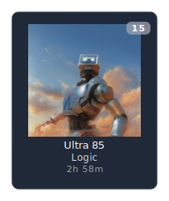</a><a href="https://open.spotify.com/album/5zi7WsKlIiUXv09tbGLKsE" target="_blank" rel="noopener noreferrer">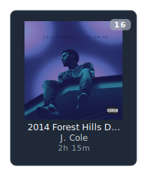</a><a href="https://open.spotify.com/album/555YaDGJyzG0QkdImBtPFD" target="_blank" rel="noopener noreferrer">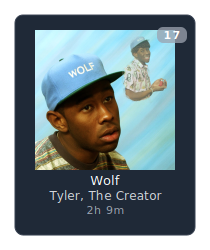</a><a href="https://open.spotify.com/album/2QRedhP5RmKJiJ1i8VgDGR" target="_blank" rel="noopener noreferrer">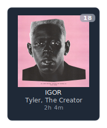</a><a href="https://open.spotify.com/album/0InO6eGRL47KErEYEoc2rP" target="_blank" rel="noopener noreferrer">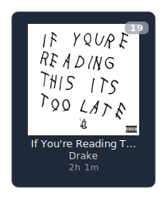</a><a href="https://open.spotify.com/album/0fSfkmx0tdPqFYkJuNX74a" target="_blank" rel="noopener noreferrer">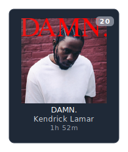</a><a href="https://open.spotify.com/album/0bLXUfNT34mna9aXq8ex68" target="_blank" rel="noopener noreferrer">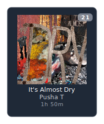</a>

<a href="#" target="_blank" rel="noopener noreferrer">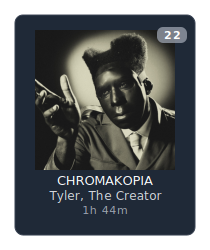</a><a href="https://open.spotify.com/album/7uYAa3GMb8TSsK5lKE3Cbn" target="_blank" rel="noopener noreferrer">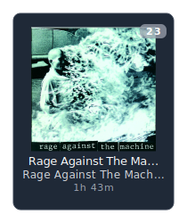</a><a href="https://open.spotify.com/album/2nkto6YNI4rUYTLqEwWJ3o" target="_blank" rel="noopener noreferrer">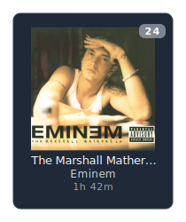</a><a href="https://open.spotify.com/album/6vVOpqIXPbM9vZWzesdTax" target="_blank" rel="noopener noreferrer">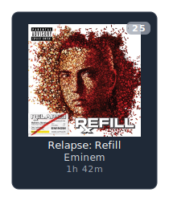</a><a href="https://open.spotify.com/album/3Gt7rOjcZQoHCfnKl5AkK7" target="_blank" rel="noopener noreferrer">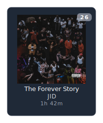</a><a href="https://open.spotify.com/album/7sFZGbkCitoqQz7Rt3LoKg" target="_blank" rel="noopener noreferrer">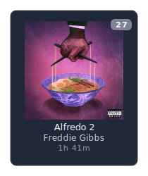</a><a href="https://open.spotify.com/album/3WFTGIO6E3Xh4paEOBY9OU" target="_blank" rel="noopener noreferrer">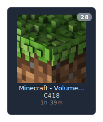</a>

<a href="https://open.spotify.com/album/3u20OXh03DjCUzbf8XcGTq" target="_blank" rel="noopener noreferrer">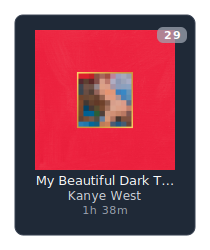</a><a href="https://open.spotify.com/album/2fSAC0ZiYnwKfzLEvyaMm8" target="_blank" rel="noopener noreferrer">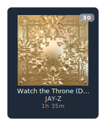</a><a href="https://open.spotify.com/album/7ycBtnsMtyVbbwTfJwRjSP" target="_blank" rel="noopener noreferrer">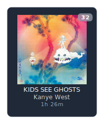</a><a href="https://open.spotify.com/album/17ScNnJ0lSWajodZaRpHdQ" target="_blank" rel="noopener noreferrer">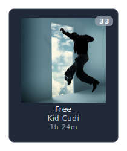</a><a href="https://open.spotify.com/album/0UMMIkurRUmkruZ3KGBLtG" target="_blank" rel="noopener noreferrer">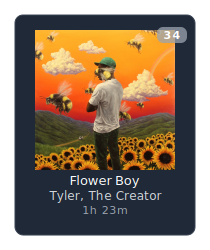</a><a href="https://open.spotify.com/album/6EzbFdrwvWpnpUjzrR57aU" target="_blank" rel="noopener noreferrer">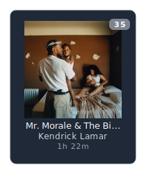</a>

<!-- STATSFM END -->

  <a href="https://github.com/teraha-dev/statsfm-to-markdown">Albums to markdown repo</a>

## 🔥 Streak Stats

<h3 align="center">
  
</h3>

## 🏆 Awards

<h3 align="center">
  
</h3>

## 📈 Contribution Graph

<h3 align="center">
  
</h3>

# 🐍 Snk

<h3 align="center">
  <a href="https://github.com/Platane/snk/">
    <picture>
      <source media="(prefers-color-scheme: dark)" srcset="https://raw.githubusercontent.com/om3ga6400/om3ga6400/refs/heads/output/github-snake-dark.svg">
      <source media="(prefers-color-scheme: light)" srcset="https://raw.githubusercontent.com/om3ga6400/om3ga6400/refs/heads/output/github-snake.svg">
      
    </picture>
  </a>
</h3>

<!--Geometria and Euclid Flex-->
