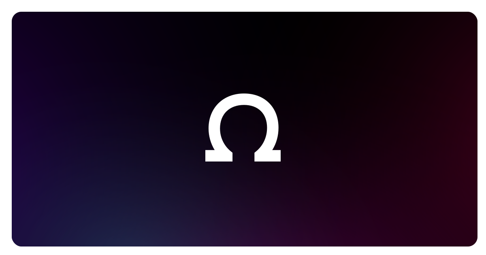

<h3 align="center">
  
</h3>

<h3 align=center>
  
  
  
</h3>

## 🎶 Spotify Activity:

<h3 align=center>
  
  
</h3>

## 📜 Programming Quote

<h3 align="center">
  
</h3>

## 🔥 Streak Stats

<h3 align=center>
  
</h3>

## 🏆 Awards

<h3 align=center>
  
</h3>

## 📊 Github Stats

<h3 align="center">
  
</h3>

## 📈 Activity Graph

<h3 align="center">
  
</h3>
